# Designing an HR Database

by Kallibek Kazbekov

## Table of Contents

- [Tech ABC Corp - HR Database Project](#tech-abc-corp---hr-database-project)
  - [Part 1: Data Architecture Foundations](#part-1-data-architecture-foundations)
    - [Introduction](#introduction)
    - [Business Scenario and Requirements](#business-scenario-and-requirements)
    - [Technical Requirements and Considerations](#technical-requirements-and-considerations)
    - [IT Department Best Practices](#it-department-best-practices)
  - [Part 2: Relational Database Design](#part-2-relational-database-design)
    - [Introduction](#introduction-1)
    - [Conceptual ERD](#conceptual-erd)
    - [Logical ERD](#logical-erd)
    - [Physical ERD](#physical-erd)
  - [Part 3: Create A Physical Database](#part-3-create-a-physical-database)
    - [Introduction](#introduction-2)
    - [DDL Implementation](#ddl-implementation)
    - [CRUD Operations](#crud-operations)
  - [Part 4: Above and Beyond](#part-4-above-and-beyond)
    - [Introduction](#introduction-3)
    - [Create a View for All Employee Attributes](#create-a-view-for-all-employee-attributes)
    - [Create a Stored Procedure for Employment History](#create-a-stored-procedure-for-employment-history)
    - [Implement User Security on the Restricted Salary Attribute](#implement-user-security-on-the-restricted-salary-attribute)
  - [Automation Using Docker and Python](#automation-using-docker-and-python)
    - [Overview](#overview)
    - [File Structure Overview](#file-structure-overview)
    - [How Automation Works](#how-automation-works)
    - [How to Launch the Project](#how-to-launch-the-project)
    - [How to Destroy the Project](#how-to-destroy-the-project)
  - [Summary](#summary)


## Part 1: Data Architecture Foundations

### Introduction
Tech ABC Corp, a rapidly growing video game company, has experienced explosive growth following the launch of its new AI-powered video game console. With the workforce expanding from 10 to 200 employees across 5 locations, the HR department is struggling to manage employee data via a shared Excel spreadsheet. This project aims to transform that spreadsheet into a live, secure, and scalable database that supports real-time data entry, updates, and future integrations.

### Business Scenario and Requirements

#### Business Overview
- **Business Partner:** Sarah Collins, Head of HR  
- **Current Situation:**  
  - Employee data is currently maintained in an Excel file containing 205 records and 15 columns.  
  - The dataset includes information such as employee ID, name, email, hire date, job title, salary, department, manager, start and end dates, location, address, city, state, and education level.
- **Challenges:**  
  - **Data Integrity:** A shared Excel file makes it difficult to ensure accuracy and consistency.  
  - **Security:** Sensitive data (e.g., employee salaries) is exposed to users who should have only read access.  
  - **Scalability:** The current method cannot support future growth or integration with other systems.
- **Future Needs:**  
  - Integration with the payroll system for attendance and paid time off data.
  - A live database system that allows both data entry and updates in real time.

#### Business Requirements
- **Purpose of the New Database:**  
  Transform the static Excel-based system into a dynamic database to improve data integrity, security, and scalability.
- **Current Data Management:**  
  Employee data is stored in an Excel workbook, which is cumbersome and prone to errors as the company grows.
- **Data Available:**  
  - The HR dataset consists of 205 records with details on employee identification, contact information, employment history, location, and education.  
  - See the attached [Excel File Structure](#) for a summary of the data fields.
- **Additional Data Requests:**  
  - Future integration with external systems (e.g., payroll) to create a comprehensive HR management solution.
- **Data Ownership and Access:**  
  - **Ownership:** The HR department, with IT support.  
  - **Access:**  
    - General employees will have read-only access using their domain-authenticated credentials.  
    - Write access and access to sensitive data (such as salaries) will be restricted to HR and management.
- **Sensitive/Restricted Data:**  
  - Employee salary information must be protected and only accessible by authorized personnel.
- **Data Retention and Backup Requirements:**  
  - Federal regulations require maintaining employee data for a minimum of 7 years.
  - Backups will follow IT best practices (detailed below) to ensure data safety and integrity.

### Technical Requirements and Considerations

#### Justifications for the New Database
1. **Enhanced Data Integrity:**  
   - Moving away from a shared Excel file to a relational database will reduce data redundancy and improve accuracy.
2. **Improved Security:**  
   - Implementing role-based access control (RBAC) ensures sensitive information, like salary data, is only available to authorized users.

#### Proposed Database Objects
- **Tables to be Created:**  
  - **employee:** Static employee information  
  - **employment_history:** Records of job transitions and employment details  
  - **job:** Job titles and sensitive salary details  
  - **department:** Departmental information  
  - **location:** Office locations and addresses

#### Data Ingestion Method
- **ETL Process:**  
  An automated ETL (Extract, Transform, Load) process will be used to import the data from the Excel workbook into the new database.

#### Data Governance and Security
- **Data Ownership:**  
  The HR department will own and manage the data with oversight and support from IT.
- **User Access Recommendations:**  
  - Utilize domain-authenticated logins.
  - Implement role-based access controls so that general users have read-only access, while HR and management receive full access—including write privileges on sensitive fields like salary.
  
#### Scalability and Flexibility
- **Normalization:**  
  The database will be normalized (up to 3NF) to ensure scalability and reduce redundancy.
- **Future Integration:**  
  The design will facilitate future integration, such as connecting with the payroll system.
- **Storage and Backup:**  
  - **Storage:** Databases will use a standard partition (minimum 1 GB) as per IT best practices, with potential for in-memory storage for high computational needs.
  - **Backup Schedule:**  
    - Standard data: Full backup once per week.  
    - Archive data: Full backup once per month.  
    - Critical data: Full backup weekly with daily incremental backups.

### IT Department Best Practices
In accordance with the IT best practices at Tech ABC Corp:
- **Security:**  
  - Database access is granted at the user level using domain-authenticated usernames.  
  - Sensitive information (e.g., salaries) will be protected by either column-level permissions or by using views that exclude such data.
- **Backups:**  
  - Backup frequency is determined by data criticality (standard, archive, or critical).
- **Storage Considerations:**  
  - Databases are provisioned with standard partitions (1 GB minimum), with the option to scale based on data growth projections.


## Part 2: Relational Database Design

### Introduction
In Part 2, the focus shifts to designing a relational database that adheres to the principles of normalization (up to 3NF). Three Entity Relationship Diagrams (ERDs) have been developed using Lucidchart to visually represent the database design at different stages. The diagrams below showcase the evolution from a broad conceptual model to a detailed physical model ready for implementation.

---

### Conceptual ERD
The **Conceptual ERD** provides a high-level view of the business entities and the relationships between them without including detailed attributes. This stage focuses on identifying the key objects such as employees, departments, jobs, locations, and employment history.

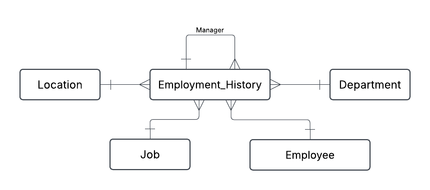

---

### Logical ERD
The **Logical ERD** refines the conceptual model by introducing attributes and ensuring that the design adheres to normalization rules (up to 3NF). This diagram includes more details, such as the specific data elements for each entity and clearly defined relationships, while still using user-friendly names.

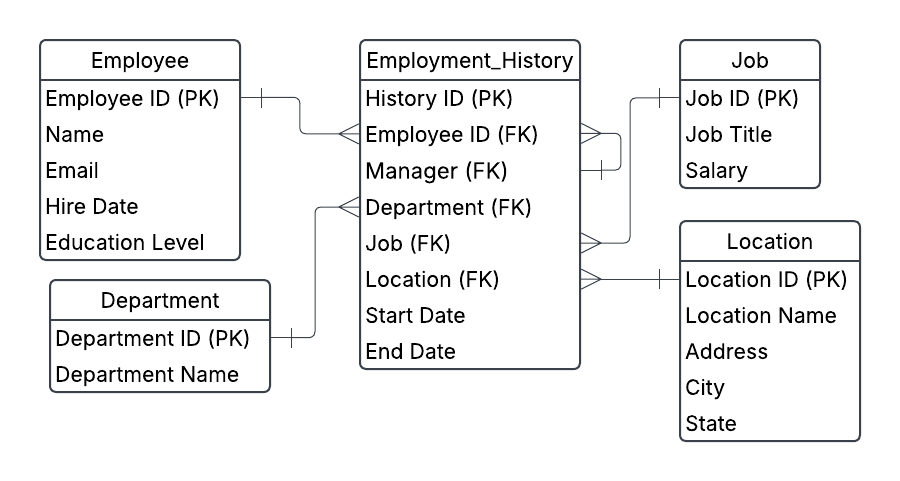

---

### Physical ERD
The **Physical ERD** represents the final blueprint that will be used to create the actual database. This model includes:
- Database-friendly naming conventions (e.g., underscore or camel case)
- Defined data types for each attribute
- Primary keys (marked in bold with a (PK) designation)
- Foreign keys (marked with an (FK) designation)
- Cardinality information with proper relationship notation

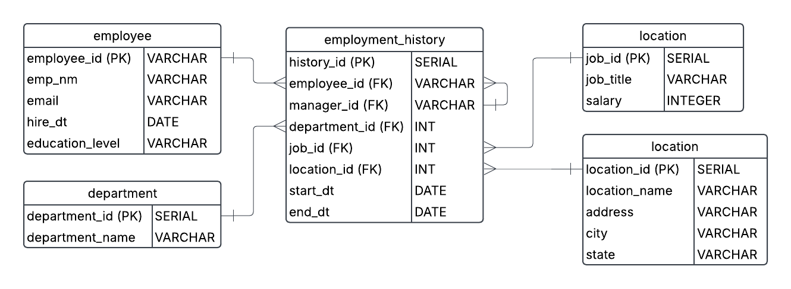

---

## Part 3: Create A Physical Database

### Introduction
In this section, we move from design to implementation by creating the physical database using SQL DDL commands and demonstrating its functionality through a series of CRUD operations. The following sections outline the key SQL queries along with screenshots that capture the execution results.

---

### DDL Implementation
The database creation is based on the provided DDL scripts [create_tables.sql](sql/create_tables.sql), which create the following tables:
- **department**
- **job** (includes the sensitive salary field)
- **location**
- **employee**
- **employment_history** (captures job transitions and employee assignments)

These scripts lay the foundation for the physical database by establishing the necessary table structures, primary keys, and foreign key relationships.

---

### CRUD Operations

#### Question 1: Return a List of Employees with Job Titles and Department Names
This query retrieves the current employment assignments by selecting employees whose `end_dt` is NULL.

```sql
SELECT e.employee_id, e.emp_nm, j.job_title, d.department_name
FROM employee e
JOIN employment_history eh ON e.employee_id = eh.employee_id
JOIN job j ON eh.job_id = j.job_id
JOIN department d ON eh.department_id = d.department_id
WHERE eh.end_dt IS NULL;
```
**Screenshot Result:**

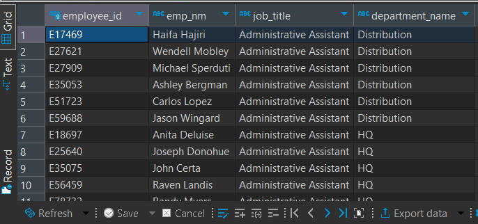

---

#### Question 2: Insert "Web Programmer" as a New Job Title

This query inserts a new record for the job title "Web Programmer" along with its associated salary.

```sql
INSERT INTO job (job_title, salary) VALUES ('Web Programmer', 55000);
```

**Screenshot Result:**

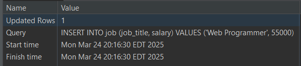

---

#### Question 3: Update the Job Title from "Web Programmer" to "Web Developer"

This query updates the job title from "Web Programmer" to "Web Developer".

```sql
UPDATE job
SET job_title = 'Web Developer'
WHERE job_title = 'Web Programmer';
```

**Screenshot Result:**

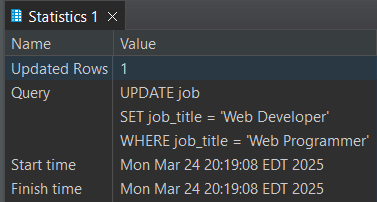

---

#### Question 4: Delete the Job Title "Web Developer" from the Database

This query removes the job title "Web Developer" from the database.

```sql
DELETE FROM job
WHERE job_title = 'Web Developer';
```

**Screenshot Result:**

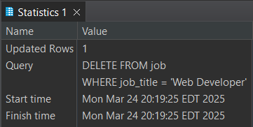

---

#### Question 5: Count Current Employees in Each Department

This query counts the number of employees in each department based on current assignments (where `end_dt` is NULL).

```sql
SELECT d.department_name, COUNT(eh.employee_id) AS employee_count
FROM department d
LEFT JOIN employment_history eh
    ON d.department_id = eh.department_id AND eh.end_dt IS NULL
GROUP BY d.department_name;

```
**Screenshot Result:**

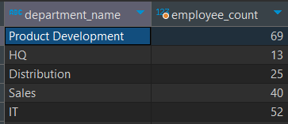

---

#### Question 6: Retrieve Current and Past Employment History for Employee Toni Lembeck

This query returns both current and historical employment details for the employee Toni Lembeck.

```sql
SELECT e.emp_nm, j.job_title, d.department_name, m.emp_nm AS manager_name, eh.start_dt, eh.end_dt
FROM employment_history eh
JOIN employee e ON eh.employee_id = e.employee_id
JOIN job j ON eh.job_id = j.job_id
JOIN department d ON eh.department_id = d.department_id
LEFT JOIN employee m ON eh.manager_id = m.employee_id
WHERE e.emp_nm = 'Toni Lembeck';
```

**Screenshot Result:**

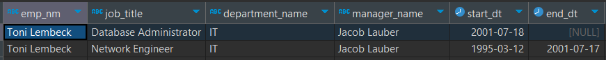

---

#### Question 7: Describe how you would apply table security to restrict access to employee salaries using an SQL server

To restrict access to employee salaries in SQL Server, I would implement Role-Based Access Control (RBAC) by creating separate roles for general users and HR/management. General users would be granted read-only access to a view or subset of the table that excludes the salary column, while HR and management roles would have full access to all columns, including salaries. Additionally, I could employ column-level security or dynamic data masking to further limit visibility of sensitive salary data, ensuring that only authorized personnel can access or modify this information.


## Part 4: Above and Beyond

### Introduction
Part 4 presents optional enhancements that add advanced functionality and usability to the HR database project. These "finishing touches" not only demonstrate higher-level SQL skills but also bring the project closer to a real-world implementation. Below are three standout suggestions that focus on creating a comprehensive view, a parameterized stored procedure, and enhanced user security.

---

### Create a View for All Employee Attributes
**Objective:**  
Develop a database view that returns all employee attributes in a format that resembles the original Excel file. This consolidated view simplifies data access for users who need a complete overview of employee details.

**SQL Code Example:**

```sql
CREATE VIEW vw_all_employees AS
SELECT 
    e.employee_id, 
    e.emp_nm, 
    e.email, 
    e.hire_dt, 
    e.education_level,
    eh.start_dt, 
    eh.end_dt,
    j.job_title, 
    j.salary,
    d.department_name,
    l.location_name, 
    l.address, 
    l.city, 
    l.state
FROM employee e
JOIN employment_history eh ON e.employee_id = eh.employee_id
JOIN job j ON eh.job_id = j.job_id
JOIN department d ON eh.department_id = d.department_id
JOIN location l ON eh.location_id = l.location_id;
```

Demonstration:

The screenshot below shows the result of querying the view:

```sql
SELECT * FROM vw_all_employees;
```

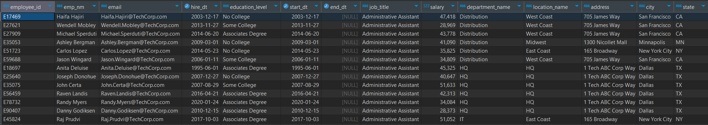

### Create a Stored Procedure for Employment History

**Objective:**  
Build a stored procedure (function) that accepts an employee name as a parameter and returns both current and past employment records. The output includes the employee's name, job title, department, manager name, start date, and end date for each job assignment.

SQL Code:

```sql
CREATE OR REPLACE FUNCTION sp_get_employment_history(empName VARCHAR)
RETURNS TABLE (
    emp_nm VARCHAR,
    job_title VARCHAR,
    department_name VARCHAR,
    manager_name VARCHAR,
    start_dt DATE,
    end_dt DATE
) AS $$
BEGIN
    RETURN QUERY
    SELECT 
        e.emp_nm, 
        j.job_title, 
        d.department_name, 
        m.emp_nm AS manager_name, 
        eh.start_dt, 
        eh.end_dt
    FROM employment_history eh
    JOIN employee e ON eh.employee_id = e.employee_id
    JOIN job j ON eh.job_id = j.job_id
    JOIN department d ON eh.department_id = d.department_id
    LEFT JOIN employee m ON eh.manager_id = m.employee_id
    WHERE e.emp_nm = empName;
END;
$$ LANGUAGE plpgsql;

```

Demonstration:
The screenshot below shows the stored procedure creation code and the execution result when using "Toni Lembeck" as the parameter.

```sql
SELECT * FROM sp_get_employment_history('Toni Lembeck');
```

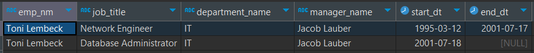


### Implement User Security on the Restricted Salary Attribute

**Objective:** 
Enhance database security by restricting access to the sensitive salary field. This involves creating a non-management user, `NoMgr`, and ensuring that while the user can access general employee data, they are prevented from viewing salary information.

**SQL Code Example:**

```sql
-- Create a non-management user without login privileges
CREATE USER NoMgr WITH NOLOGIN;

-- Grant read-only access to general tables
GRANT SELECT ON employee TO NoMgr;
GRANT SELECT ON employment_history TO NoMgr;
GRANT SELECT ON department TO NoMgr;
GRANT SELECT ON location TO NoMgr;

-- Since PostgreSQL does not support column-level DENY permissions,
-- create a view excluding the salary column and grant access to that view.
CREATE VIEW vw_job_nosalary AS
SELECT job_id, job_title
FROM job;
GRANT SELECT ON vw_job_nosalary TO NoMgr;
```

## Automation Using Docker and Python

### Overview
This project is fully automated using Docker Compose and a Python-based data loader. The automation covers the entire lifecycle of the database setup, data population, and execution of advanced SQL scripts (CRUD queries and Part 4 enhancements). All necessary SQL scripts and data loading procedures are executed automatically when you launch the project.

### File Structure Overview

- **SQL Scripts:**  
  - [create_tables.sql](sql/create_tables.sql): Creates the base tables for the database.
  - [crud_queries.sql](sql/crud_queries.sql): Contains CRUD operations to validate the database.
  - [part4.sql](sql/part4.sql): Contains the advanced SQL scripts (views, functions, and user security enhancements).

- **Data Loader:**  
  - [Dockerfile](data-loader/Dockerfile): Builds a lightweight Python image with the necessary dependencies.
  - [load_data.py](data-loader/load_data.py): Python script that:
    - Waits for the PostgreSQL database to be ready.
    - Loads data from an Excel file.
    - Inserts data into the database.
    - Executes SQL queries from [crud_queries.sql](sql/crud_queries.sql) and [part4.sql](sql/part4.sql).
  - [requirements.txt](data-loader/requirements.txt): Lists the Python dependencies.

- **Docker Compose:**  
  - [docker-compose.yml](docker-compose.yml): Orchestrates two services:
    - **db:** Runs PostgreSQL using the `postgres:13` image and initializes the database with [create_tables.sql](sql/create_tables.sql).
    - **data-loader:** Builds and runs the Python data loader, which depends on the `db` service.

---

### How Automation Works

1. **Container Initialization:**
   - The **db** service starts using the PostgreSQL image. It automatically runs [create_tables.sql](sql/create_tables.sql) to create the base schema.
   - The **data-loader** service is built from the `data-loader` directory and waits until the database becomes available.

2. **Data Loading & SQL Execution:**
   - The [load_data.py](data-loader/load_data.py) script connects to the database.
   - It loads and parses the Excel dataset, then populates the relevant tables.
   - After inserting the data, the script reads and executes the SQL commands from:
     - [crud_queries.sql](sql/crud_queries.sql) (to verify basic database functionality)
     - [part4.sql](sql/part4.sql) (to implement advanced features like views, functions, and user security)
   - Throughout the process, the script outputs status messages to confirm successful execution.

---

### How to Launch the Project

1. **Ensure Docker is Installed:**  
   Verify that Docker and Docker Compose are installed on your system.

2. **Build and Start the Containers:**  
   Open a terminal in the project’s root directory (where [docker-compose.yml](docker-compose.yml) is located) and run:
   ```bash
   docker-compose up --build
   ```
   This command will:
   - Build the `data-loader` image from the Dockerfile.
   - Start both the `db` and `data-loader` services.
   - Automatically execute the SQL initialization, data loading, and advanced SQL scripts.
   - Display logs indicating progress (e.g., connection messages, data loaded successfully, SQL scripts executed successfully).

---

### How to Destroy the Project

1. **Stop the Running Containers:**  
   In the terminal where the project is running, press `Ctrl+C` to stop the services.

2. **Remove Containers and Networks:**  
   Run the following command to remove the containers and the associated network:
   ```bash
   docker-compose down
   ```
   For a complete cleanup (including volumes), run:
   ```bash
   docker-compose down -v
   ```
   This command will:
   - Stop and remove the running containers.
   - Remove any volumes that were created (e.g., for persisting the database data).

---


## Summary
This project demonstrates a comprehensive approach to designing, implementing, and automating an HR database for Tech ABC Corp. It starts with outlining the business requirements and technical considerations in Part 1, where we establish the need for a secure, scalable, and efficient database to replace an outdated Excel-based system.

In Part 2, we present detailed database designs through multiple ERDs—from conceptual to physical—laying the groundwork for a robust relational model. Part 3 covers the actual creation of the database, execution of SQL DDL commands, and verification of database functionality via CRUD operations.

Part 4 introduces advanced enhancements such as creating views, stored procedures, and user security measures to further secure sensitive data. The entire project is automated using Docker Compose and a Python-based data loader, ensuring a streamlined setup process. With simple commands, you can launch the complete environment, load data, execute all necessary SQL scripts, and easily tear down the environment when needed.

This project not only meets the technical requirements but also provides a practical, real-world example of database design, implementation, and automation best practices.